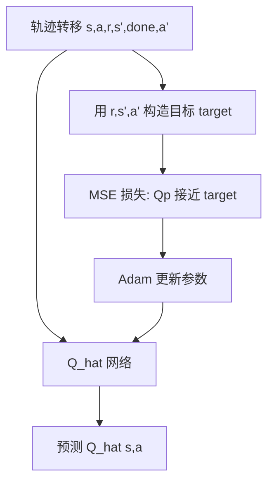

<!-- 用途：结合代码与实例，说明从轨迹 CSV 到 IF-THEN 规则与决策树图的具体生成步骤。 -->
# 决策树生成流程

从轨迹 CSV 到 VIPER 加权 CART 决策树与 IF-THEN 规则，按 `causal/decision_tree` 实际代码顺序说明。

---

## 一、总览


| 阶段 | 模块 | 主要输出 |
|------|------|----------|
| 0 数据 | `trajectory_io.py` | 内存中的 `TransitionBatch` |
| 1 FQE | `fqe.py` | `q_hat.pt` |
| 2 损失 | `l_hat.py` | `l_hat.csv` |
| 3 权重 | `weights.py` | `weights.csv` |
| 4～6 树与规则 | `viper_cart.py` | `viper_out/*` |

---

## 二、输入数据与清洗（阶段 0）

### 2.1 数据来源

一般由 `causal/main.py` 仿真导出，例如：

`causal/trajectories/trajectory_LLdV3_S0.csv`

### 2.2 必需列

| 列 | 含义 |
|----|------|
| `s_0` … `s_7` | 当前状态（8 维，决策树特征 X） |
| `s_next_0` … `s_next_7` | 下一状态（FQE 用） |
| `action` | 当前动作（决策树标签 y） |
| `reward` | 奖励 |
| `episode` | 回合编号 |
| `dw`, `truncated` | 终止标志 |

### 2.3 清洗规则（`load_trajectory_csv` + `build_transitions`）

1. **缺列**：直接报错，列出缺少的列名。
2. **数值化**：`s_*`、`action`、`reward` 等 `to_numeric`；状态/动作/奖励出现 **NaN** → 报错：`请清洗轨迹后再训练`。
3. **转移构造**（供 FQE，不是 CART 直接用）：
   - 同一 `episode` 内：`a_next[i] = action[i+1]`；
   - 跨回合末行 / `dw` / `truncated`：`done[i]=1`，`a_next[i]=0`（训练时 mask）。

**实例**（3 行示意）：

| 行 | episode | s_7 | action | 说明 |
|----|---------|-----|--------|------|
| 0 | 1 | 0.3 | 2 | 正常步 |
| 1 | 1 | 0.6 | 2 | 正常步 |
| 2 | 2 | … | 0 | episode 切换 → 行 1 的 `done=1` |

CART 阶段只用 **`s_0…s_7` → `action`**，每行一条样本，与 CSV 行一一对应。

---

## 三、FQE 训练 Q_hat（阶段 1）

### 3.1 FQE 是什么

**FQE（Fitted Q Evaluation，拟合 Q 评估）** 是一种**离线**方法：不再与环境交互，只利用已有轨迹 CSV，训练一个神经网络去**近似**「在某个状态下执行某个动作，长期能拿多少累计回报」——记为 **\(Q(s,a)\)**。

在本流水线里，网络记为 **`Q_hat`**（`q_network.py` 中的 `QHatNetwork`），保存为 **`q_hat.pt`**。

它和后面决策树的关系：

- 决策树要学的是「什么状态下该做什么动作」；
- FQE 先给每一步打一个**价值标尺**：实际动作比「Q 意义下的最优动作」差多少 → 下一阶段算 `l_hat`、VIPER 加权采样。

### 3.2 在本项目里「如何做到」

整体思路：**把轨迹里每一条转移当作监督样本**，用 Bellman 思想构造「目标 Q 值」，让网络输出的 \(Q_{\hat{}}(s,a)\) 不断逼近该目标。



**要学的函数**：输入状态 \(s\)（8 维 `s_0…s_7`），输出每个动作的 Q 值；取其中第 \(a\) 维即为 \(Q_{\hat{}}(s,a)\)。

**网络结构**（`QHatNetwork`）：

```text
s (8维) → Linear(256) → ReLU → Linear(256) → ReLU → Linear(n_actions)
```

`n_actions` 由轨迹里 `action` 的最大编号 + 1 推断（如动作为 0～3，则输出 4 维）。

### 3.3 如何训练（逐步）

**代码入口**：`fqe.py` 中 `train_q_hat(trans, FQETrainConfig)` → `save_q_hat` → `q_hat.pt`

**输入**：阶段 0 构造的 `TransitionBatch`，每条样本包含：

| 字段 | 含义 |
|------|------|
| `s` | 当前状态 |
| `a` | 当前动作 |
| `r` | 即时奖励 |
| `s_next` | 下一状态 |
| `done` | 是否终止（跨回合 / dw / truncated） |
| `a_next` | 下一动作（同回合内为下一行 `action`） |

**训练循环**（默认 30 个 epoch，batch=256，打乱抽样）：

1. 取一批 `(s, a, r, s_next, done, a_next)`；
2. 网络前向得到 **预测值** `q_pred = Q_hat(s, a)`；
3. 用当前网络（及可选的目标网络）在 **下一状态** 上算 **bootstrap 目标** `target`（见下节「实现细节」）；
4. 损失：`MSE(q_pred, target)`，反向传播 + Adam 更新；
5. 重复直到 epoch 结束；最后一轮 loss 写入 checkpoint 元数据。

**实现细节（bootstrap 目标，默认 SARSA 模式）**：

- 含义：这一步的 Q 值，应接近「立刻拿到的奖励 + 折扣后的下一步 Q」；
- 默认用 **轨迹里真实出现的下一步动作** \(a'\)（SARSA），而不是强行用 \(\max_{a'} Q(s',a')\)；
- 若 `done=1`，不再加未来项（`not_done` 为 0）。

可选 `target=max_q`：下一步用 \(\max_{a'} Q_{\hat{}}(s', a')\) 构造目标（更偏「最优后继」假设）。

**可选稳定训练**：`use_target_network=True` 时维护慢更新的目标网络 `q_tgt`（软更新系数 `target_tau`），减轻目标值随网络剧烈晃动；默认关闭，直接用当前网络算 target。

### 3.4 训练实例（单条转移）

假设某一行：

| 量 | 值 |
|----|-----|
| \(s\) | `[0.1, …, 0.3]`（8 维） |
| \(a\) | `2`（斜切切线机动） |
| \(r\) | `0.5` |
| \(s'\) | 下一状态向量 |
| `done` | `0`（回合未结束） |
| \(a'\) | `3`（下一步真实动作） |

某一训练步：

1. 网络输出 \(Q_{\hat{}}(s,2)=0.8\)（预测）；
2. 用网络在 \(s'\) 上查 \(Q_{\hat{}}(s',3)=0.6\)，得到 target \(= 0.5 + 0.99 \times 0.6 = 1.094\)；
3. 损失 \((0.8 - 1.094)^2\)，更新权重使 \(Q_{\hat{}}(s,2)\) 向 1.094 靠近。

百万行轨迹、多 epoch、多 batch 重复上述过程，得到全状态空间上较平滑的 Q 估计。

### 3.5 输出与后续使用

| 产物 | 内容 |
|------|------|
| `fqe_out/q_hat.pt` | 网络权重 `state_dict` + 元数据（`state_dim`、`n_actions`、`gamma`、`final_loss` 等） |
| 阶段 2 | `load_q_hat` 加载后**冻结参数**，只做前向，算每行 `l_hat` |

**配置**（`run_pipeline.py` / CLI）：`fqe_epochs`、`fqe_lr`、`fqe_batch_size`、`fqe_hidden`、`fqe_gamma`、`fqe_target`（`sarsa` \| `max_q`）、`fqe_device`（`cuda` / `cpu`）。

---

## 四、逐行 l_hat（阶段 2）

**目的**：标出每一步「若按 Q 贪心选动作，比实际动作好多少」——越大越值得在 VIPER 里多采样。

**代码**：`compute_l_hat` → `l_hat.csv`

对第 \(i\) 行（状态 \(s_i\)，实际动作 \(a_i\)）：

| 量 | 计算 |
|----|------|
| `Q_hat(s_i, k)` | 网络前向，所有动作 k |
| `V_hat` | \(\max_k Q_hat(s_i, k)\) |
| `Q_sa` | \(Q_hat(s_i, a_i)\) |
| **`l_hat`** | **`V_hat - Q_sa`** |

**实例**（单行）：

| V_hat | Q_sa | l_hat | 含义 |
|-------|------|-------|------|
| 1.20 | 0.85 | **0.35** | 实际动作比最优差 0.35，权重大 |
| 1.10 | 1.08 | **0.02** | 接近最优，权重小 |

**输出列**：`episode`, `action`, `V_hat`, `Q_sa`, `l_hat`, `Q_hat_a0…`

---

## 五、采样权重 weights（阶段 3）

**目的**：把 `l_hat` 变成概率，供 VIPER **有放回**抽行；只算一次，多轮 VIPER 共用。

**代码**：`compute_weights` → `weights.csv`

\[
w\_raw_i = \max(l\_hat_i,\ 0) + \varepsilon,\quad
weights_i = \frac{w\_raw_i}{\sum_j w\_raw_j}
\]

默认 \(\varepsilon = 10^{-6}\)。

**实例**（3 行）：

| 行 | l_hat | w_raw | weights（归一化后） |
|----|-------|-------|---------------------|
| A | 0.40 | 0.40 | 0.50 |
| B | 0.20 | 0.20 | 0.25 |
| C | -0.10 → 0 | 1e-6 | ≈0 |

行 A 被 VIPER 抽中的概率约为 B 的 2 倍。

---

## 六、VIPER + CART + 规则（阶段 4～6）

### 6.1 特征与标签

```text
X = [s_0, s_1, …, s_7]    # 来自轨迹 CSV
y = action                 # 整数动作编号，展示时映射为中文名
```

动作名映射见 `DT/dt_auto_pipeline.py` 的 `CLASS_MAPPING`（如 `2` → `斜切切线机动`）。

### 6.2 VIPER 外循环（`run_viper_loop`）

固定 `weights.csv`，重复 `n_round` 轮（默认 5）：

1. 对 `weights` 加少量乘性噪声再归一化（避免每轮抽到完全相同）；
2. **重采样**：`idx = choice(N, size=M, replace=True, p=weights)`  
   - `M = N`（默认，`resample_size=0`）时根节点样本数可 **> 原始行数**（如 1,000,029）；
3. 用 `(X[idx], y[idx])` 训练 **CART**：`DecisionTreeClassifier(max_depth=6)`；
4. 记录本轮在重采样集 / 全量上的准确率。

**最后一轮**的 CART 模型用于导出树与规则。

### 6.3 决策树如何分裂

与 sklearn 一致：

| 方向 | 条件 | 图上根边标注 |
|------|------|----------------|
| **左子树** | `特征 <= 阈值` | True（仅根边常标） |
| **右子树** | `特征 > 阈值` | False |

### 6.4 节点框内各字段（PDF / `policy_tree_debug.dot`）

以根节点为例：

```text
s_7 ≤ 0.5
基尼系数 = 0.461
样本数 = 1000029
类别分布 = [123934, 85227, 714590, 76278]
class = 斜切切线机动
```

| 字段 | 含义 |
|------|------|
| 第一行 | **分裂条件**（不是某一个时刻的瞬时值） |
| 基尼系数 | 该节点动作标签混乱程度，越小越纯 |
| 样本数 | 落到该节点的（重采样后）条数 |
| 类别分布 | 各类动作在该节点的（加权）计数 |
| class | 类别分布的**多数类**；**叶节点**的 class 才是规则里的 `THEN` 动作 |

### 6.5 决策规则生成（DFS）

**代码**：`extract_decision_rules_if_then`（与 `DT/dt_auto_pipeline.py` 相同）

从根走到每个**叶节点**，路径上条件用 `AND` 连接：

```text
IF 条件1 AND 条件2 AND … THEN 动作名
```

**真实输出示例**（`rules.txt` 第 1 条）：

```text
IF s_7 <= 0.5 AND s_1 <= 1.2335858941078186 AND s_3 <= -0.0002921249397331849
   AND s_6 <= 0.5 AND s_3 <= -0.7166992127895355 AND s_5 <= 0.13251204788684845
THEN 爬升1
```

**如何用规则判断一条新样本**：

1. 取该行的 `(s_0,…,s_7)`；
2. 从上到下匹配，**第一条** IF 全满足的规则的 `THEN` 即为推荐动作；
3. 若无匹配，需业务上定义默认动作（当前实现为「每叶一条」，覆盖训练分布中的叶）。

**实例**：

| s_7 | s_1 | s_5 | 命中 |
|-----|-----|-----|------|
| 0.3 | 1.0 | 0.10 | 第 1 条 → 爬升1 |
| 0.3 | 1.0 | 0.20 | 第 2 条 → 爬升2 |
| 0.8 | … | … | 走 `s_7 > 0.5` 分支下的其它规则（约第 17 条起） |

---

## 七、输出目录结构

默认：`{轨迹.csv 同目录}/fqe_out/`

```text
fqe_out/
├── q_hat.pt                 # 阶段 1
├── l_hat.csv                # 阶段 2
├── weights.csv              # 阶段 3
├── final_result.json        # 一键运行汇总
└── viper_out/
    ├── rules.txt            # IF-THEN 规则（主交付）
    ├── rules.json
    ├── viper_summary.json   # 各轮准确率
    ├── tree.json            # 嵌套树结构
    ├── tree_nodes.csv       # 扁平节点表
    ├── policy_tree_debug.dot
    ├── policy_tree.pdf      # 流程图（需 Graphviz）
    └── policy_tree.png      # 可选
```

---

## 八、如何运行

### 8.1 一键（推荐）

编辑 `run_pipeline.py` 中 `RUN_CONFIG["trajectory_csv"]`，然后：

```bash
cd F:\cause_analysis\Algorithm
python causal/decision_tree/run_pipeline.py
```

### 8.2 分阶段 CLI

```bash
cd F:\cause_analysis\Algorithm

# 全流程
python -m causal.decision_tree --csv causal/trajectories/trajectory_LLdV3_S0_1.csv --phase all

# 已有 q_hat，只算 l_hat
python -m causal.decision_tree --phase l_hat --csv ... --checkpoint fqe_out/q_hat.pt

# 已有 l_hat，只算 weights
python -m causal.decision_tree --phase weights --l-hat-csv fqe_out/l_hat.csv

# 已有 weights，只跑 VIPER + 树 + 规则
python -m causal.decision_tree --phase viper --csv ... --weights-csv fqe_out/weights.csv
```

### 8.3 校验与看图

```bash
# 检查 tree.json 路径约束
python -m causal.decision_tree.validate_tree_json fqe_out/viper_out/tree.json

# 仅有 .dot 时再渲染 PNG
python -m causal.decision_tree.render_tree_image --dot fqe_out/viper_out/policy_tree_debug.dot --format png
```

---

## 九、端到端数字实例（串联）

假设某 CSV 有 **N = 1,000,000** 行：

1. **清洗**：无 NaN，`build_transitions` 得到 `done_rate ≈ 0.01`。
2. **FQE**：30 epoch 后 `q_hat.pt`，`final_loss` 写入 checkpoint。
3. **l_hat**：某行 `V_hat=1.2, Q_sa=0.8` → `l_hat=0.4` 写入 `l_hat.csv`。
4. **weights**：全表 `w_raw` 求和归一化 → 该行 `weights ≈ 4e-7`（取决于全表分布）。
5. **VIPER 第 5 轮**：按 `weights` 有放回抽 **M=1,000,000** 行（可重复）→ 训练 `max_depth=6` 的 CART → 127 个节点、64 条叶规则。
6. **规则**：根分裂 `s_7 <= 0.5`；左子树内再分 `s_1 <= 1.234` … 直到叶 → 写出 64 条 `IF … THEN …`。
7. **可视化**：`policy_tree.pdf` 中方框即节点，边向左为 True（≤），向右为 False（>）。

---

## 十、模块对照表

| 文件 | 职责 |
|------|------|
| `trajectory_io.py` | 读 CSV、转移构造、NaN 检查 |
| `fqe.py` / `q_network.py` | FQE 训练与加载 Q 网络 |
| `l_hat.py` | `l_hat = V_hat - Q_sa` |
| `weights.py` | `w_raw`、`weights` |
| `viper_cart.py` | 重采样、CART、规则、tree.json、PDF |
| `run_pipeline.py` | 一键串联 |
| `cli.py` | 命令行分阶段 |
| `validate_tree_json.py` | 树路径逻辑校验 |

---

## 十一、常见问题

| 现象 | 原因 |
|------|------|
| 根节点样本数 > 原始行数 | VIPER 有放回重采样 |
| PDF 上只有根边标 True/False | sklearn `export_graphviz` 默认行为，其余层左≤右> |
| `s_1<=1.234` 与 `s_1>1.379` 同时出现 | 仅在 `s_1>1.234` 分支下再细分，不矛盾 |
| `tree.json` 里 `class_counts` 全 0 | 导出时对浮点计数 `int()` 截断；以 PDF/`rules.txt` 为准 |

更细的参数调优见 `run_pipeline.py` 的 `RUN_CONFIG` 注释与 `README.md`。
